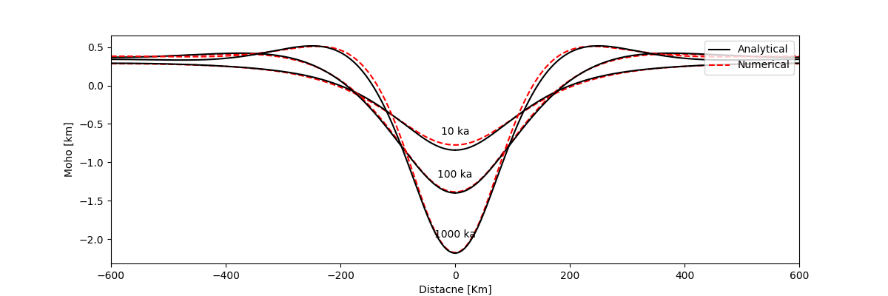

# VE Analytical Model


Trying to use numerical modelling to reproduce the results of analytical models. Two analytical models are listed below. Solution of time-dependent
topography at top and Moho boundaries in a Maxwellian medium are got by applying Laplace transform, Fourier series and propagator matrix technique to the governing Equations.


### Loading Model (Zhong, 1997 )

An analytic model coupling crust and mantle with a Maxwellian rheology is formulated to examine crustal compensation for different rheological structure. The model has a initial topography and relaxes through the time.


#### Model Setups:


#### Model Results:

- FreeSurface_DefTop 

  ```python
  # Create boundary condition
  self._conditions = uw.conditions.DirichletCondition(
      variable=self.TField,
      indexSetsPerDof=(self.top + self.bottom,))
  # Create Eq System
  self._system = uw.systems.SteadyStateHeat(
      temperatureField=self.TField,
      fn_diffusivity=1.0,
      conditions=self._conditions)
  ```

  

- FreeSurface_DefTop&Moho (see details in _freesurface_moho.py)

      self._conditions = uw.conditions.DirichletCondition(
              variable=self.TField,
              indexSetsPerDof=(self.top + self.bottom + self.interface,))

|                      FreeSurface_DefTop                      |                   FreeSurface_DefTop&Moho                    |
| :----------------------------------------------------------: | :----------------------------------------------------------: |
|  |  |
|  |  |


### Convergence Model (Zhong&Zuber, 2000)

Crustal shortening is applied through a horizontal velocity boundary conditions on the surface. In numerical modeling, the velocity field in left and right side are balanced by in and out flow.


#### Model Setups:


#### Model Results:

From the analytical solutions:


While the results I get:


### Reference

- Zhong, S. (1997). Dynamics of crustal compensation and its influences on crustal isostasy. *Journal of Geophysical Research: Solid Earth*, *102*(B7), 15287-15299.
- Zhong, S., & Zuber, M. T. (2000). Crustal compensation during mountain‐building. *Geophysical research letters*, *27*(18), 3009-3012.
